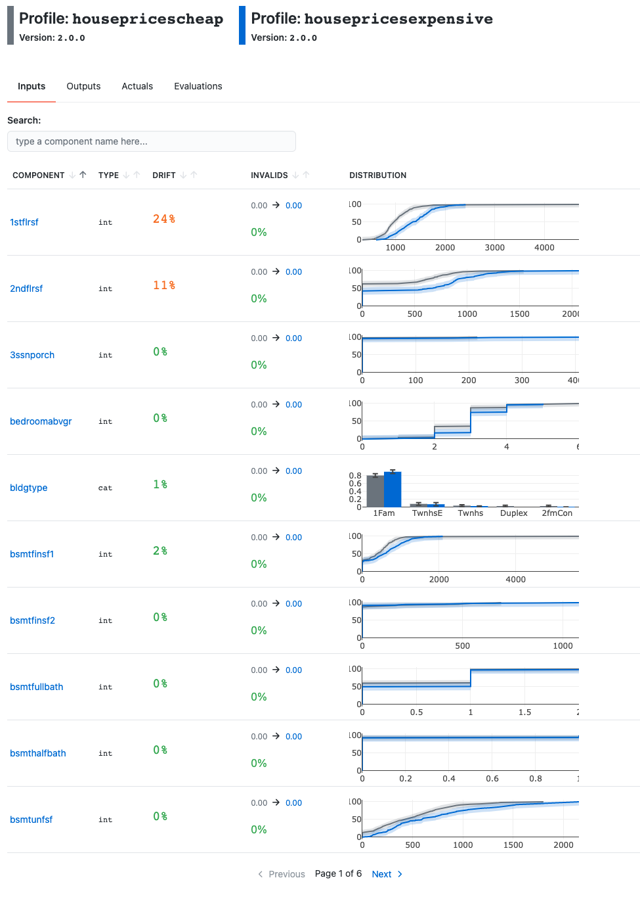

<p align="center">
  
</p>

# Raymon: a data quality and model performance monitoring library


[](https://github.com/psf/black)
<a href="https://github.com/raymon-ai/raymon/blob/master/LICENSE.md"></a>
<a href="https://pypi.org/project/raymon/"></a>
</p>

## What is Raymon?
The raymon Python library helps you monitor and troubleshoot ML models in production. It offers the following functionality:
- It includes extractors that help you **extract valuable metrics** from input data, output data or model internals.
- It lets you build **data profiles** for those metrics, and lets you use those to **validate & monitor data and models** in production.
- It lets you log data and metadata to **make model predictions traceable and easily debuggable**.

Raymon is open source and can be used standalone, but is made to integrate with the [Raymon.ai Observability Hub for ML systems]((http://raymon.ai)). This observability hub requires minimal setup, allows you to monitor data quality and model performance over multiple slices of your data, it alerts you when something is wrong and provides you with troubleshooting tooling for further analysis. It is very extensible and it can serve for all data and model types. Raymon is under active development and all feedback and suggestions are welcome!


## Docs & Examples
- Docs: https://docs.raymon.ai
- Example Notebooks: https://github.com/raymon-ai/raymon/tree/master/examples


## At a glance

### Installation

```bash
pip install raymon
```
### Building a model profile
Building a `ModelProfile` captures your expected model data characteristics...

```python
from raymon.profiling.extractors.structured import generate_components

profile = ModelProfile(
    name="HousePricesCheap",
    version="2.0.0",
    components=[
        InputComponent(name="feature_1", extractor=ElementExtractor(element="feature_1")),
        InputComponent(name="feature_2", extractor=ElementExtractor(element="feature_2")),
        InputComponent(name="feature_3", extractor=ElementExtractor(element="feature_3")),
        InputComponent(name="feature_4", extractor=ElementExtractor(element="feature_4")),               
        OutputComponent(name="prediction", extractor=ElementExtractor(element=0)),
        ActualComponent(name="actual", extractor=ElementExtractor(element=0)),
        EvalComponent(name="abs_error", extractor=AbsoluteRegressionError()),
    ],
    reducers=[
        MeanReducer(
            name="MAE",
            inputs=["abs_error"],
            preferences={"mean": "low"},
            results=None,
        )
    ],
)
profile.build(input=X, output=y_pred, actual=y_test)
profile.save(".")
```
### Validating production data
... and can then be used in production code to validate your incoming data and model performance monitoring.

```python
profile.validate_input(row)
profile.validate_outputs(prediction)
```
### Inspect and contrast model profiles
Raymon also lets you inspect and contrast profiles against each other.



### Logging text, data and tags

Moreover, Raymon makes model predictions debuggable by enabling you to log relevant text, data and tags from anywhere in your code. You can later use these tags and data objects to debug and improve your systems.

```python
import pandas as pd
import numpy as np
from PIL import Image

import raymon.types as rt
from raymon import Trace, RaymonAPILogger, Tag


logger = RaymonAPILogger(project_id=project_id)
trace = Trace(logger=logger, trace_id=None)

# Logging text messages
trace.info("You can log whatever you want here")

# Tagging traces
trace.tag([
        Tag(name="sdk_version", value="1.4.2", type="label"),
        Tag(name="prediction_time_ms", value="120", type="metric")
    ])

# Logging data
img = Image.open("./data_sample/castinginspection/def_front/cast_def_0_0.jpeg")
df = pd.DataFrame(arr, columns=['a', 'b'])

trace.log(ref="pandas-ref", data=rt.DataFrame(df))
trace.log(ref="image-ref", data=rt.Image(img))

```
For more information, check out our docs & examples!

