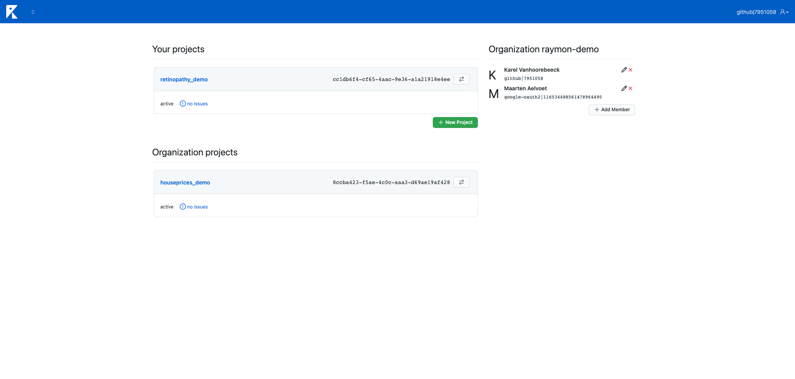

==================================
Installation, Deployment and Setup
==================================
Raymon offers a client library and a backend. This backend can be self hosted, or can be hosted by us. 

---------------------------
Client library
---------------------------
Installation from PyPI is the default way to install the Raymon client library. This library can be used to integrate in your production code and send data to the Raymon backend.

.. code:: bash

    $ pip install raymon

--------------
Raymon backend
--------------
You can either host the Raymon backend yourself, or use our cloud hosted backend. The public sandbox is currently hosted at https://api.raymon.ai/v0, with the web UI at https://ui.raymon.ai.

You can also host the backend yourself. It runs on Docker (Swarm mode) or Kubernetes. To deploy the backend yourself, follow the instructions at https://github.com/raymon-ai/backend 

-----------------------------------
Creating Projects and Organizations
-----------------------------------
After deployment, you can go to the UI (https://ui.raymon.ai by default) and log in. If this is your first login, you should see something like the image below.  

.. figure:: screens/emptyhomepage.png
  :width: 800
  :alt: The current view on first login.
  :class: with-shadow with-border

Creating a project
==================
Before being able to push data to the backend, you need to create a project. You can do so by clicking the green button and completing the popover form. Afterwards, the page should look like as follows.

.. figure:: screens/project_created.png
  :width: 800
  :alt: The view after creating a project.
  :class: with-shadow with-border

Creating an organization
========================
You can create an organization by clicking the "create organization" button and giving your organization a name. Afterwards, you can add team members to your organization by clicking the "Add Member" button and entering your coworkers user id (which can be found at the top right of the screen after logging in) and a readable name.

--------------------
Transfering Projects
--------------------
When creating a project, you own it and only you have access to it. By clicking the transfer button at the top right of the project box, you can transfer the project to your organization. When a project belongs to your organization, team members get access to the project too. All projects where production systems write data to should probably be owned by your organization. 

.. figure:: screens/transfer.png
  :width: 400
  :alt: Transferring a project by clicking on the icon.
  :class: with-shadow with-border

When all is set up, your screen could look as follows.

