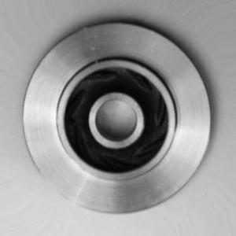

# Building a profile: computer vision

Constructing model profiles for computer vision data works the same as for structured data or any data type. The main difference is the extractors that are used to extract characteristics \(or "features"\) from the data. We'll show a few examples of extractors below.

Raymon includes a set of [out-of-the-box extractors](available-extractors.md), and we're always interested in hearing about ideas to add more. If you are missing an extractor, let us know and we may help you [implement your own extractor ](building-computer-vision.md)it and may even adopt in in our set of extractor.s

## Watching input image features

To illustrate some features you can extract from input images, we'l use the Pilot technocast dataset taken from [Kaggle](https://www.kaggle.com/ravirajsinh45/real-life-industrial-dataset-of-casting-product). This dataset can be used to train your own manufacturing quality inspection model. Manufacturing quality inspection is an interesting use case, because all images should look rather similar.

The goal is to classify images based on production quality. The image below shows and example of what data looks like. A data sample is also included in [`raymon/tests/sample_data/castinginspection`](https://github.com/raymon-ai/raymon/tree/master/raymon/tests/sample_data/castinginspection)\`\`



We will not build a full model here, but let's see how we can watch some data features. The following snippet loads the data.

```python
from PIL import Image
from pathlib import Path

DATA_PATH = Path("../raymon/tests/sample_data/castinginspection/ok_front/")
LIM = 150


def load_data(dpath, lim):
    files = dpath.glob("*.jpeg")
    images = []
    for n, fpath in enumerate(files):
        if n == lim:
            break
        img = Image.open(fpath)
        images.append(img)
    return images


loaded_data = load_data(dpath=DATA_PATH, lim=LIM)
```

After loading the data, we can build a simple model profile, which will watch the images sharpness and outlier score. This way, we can monitor our data for data breakdown or drift.

```python
from raymon import ModelProfile, InputComponent
from raymon.profiling.extractors.vision import Sharpness, DN2AnomalyScorer


profile = ModelProfile(
    name="casting-inspection",
    version="0.0.1",
    components=[
        InputComponent(name="sharpness", extractor=Sharpness()),
        InputComponent(name="outlierscore", extractor=DN2AnomalyScorer(k=16)),
    ],
)

profile.build(input=loaded_data)
profile.view()
```

Viewing the profile leads to the following visualisation:


## Watching output features: YOLO detection confidence example

Watching your input images in one thing, but you could of course watch features of your model output, actuals or error metrics. Here, we'll give a small example of how you'd approach tracking your object detection confidence \(using YOLO\). We'll skip loading the YOLO model itself, we have included some model inputs and predictions of the COCO dataset in `raymon/tests/sample_data/coco.`

```python
import pickle
from raymon.profiling.components import DataType
from raymon import ModelProfile, InputComponent, OutputComponent, ActualComponent, EvalComponent
from raymon.profiling.extractors.vision import YoloConfidenceExtractor, Sharpness
from raymon.profiling.scores import MeanScore

with open("/Users/kv/Raymon/Code/raymon/raymon/tests/sample_data/coco/input-output.pkl", "rb") as f:
    images, outputs = pickle.load(f)

profile = ModelProfile(
    name="Yolo",
    version="1.0.0",
    components=[
        InputComponent(name="sharpness", dtype=DataType.FLOAT, extractor=Sharpness()),
        OutputComponent(name="confidence", extractor=YoloConfidenceExtractor()),
    ],
    scores=[MeanScore(name="mean_confidence", inputs=["confidence"], preference="high")],
)

profile.build(input=images, output=outputs)
```

Easy right? Now the output component tab of the profile view looks like this:


## Wrapping up

We hope you get the gist. You can extract any feature you deem relevant from your data, and use a model profile to watch how this feature evolves over time. How exactly you can use profiles for data validation and monitoring we'll see next.

